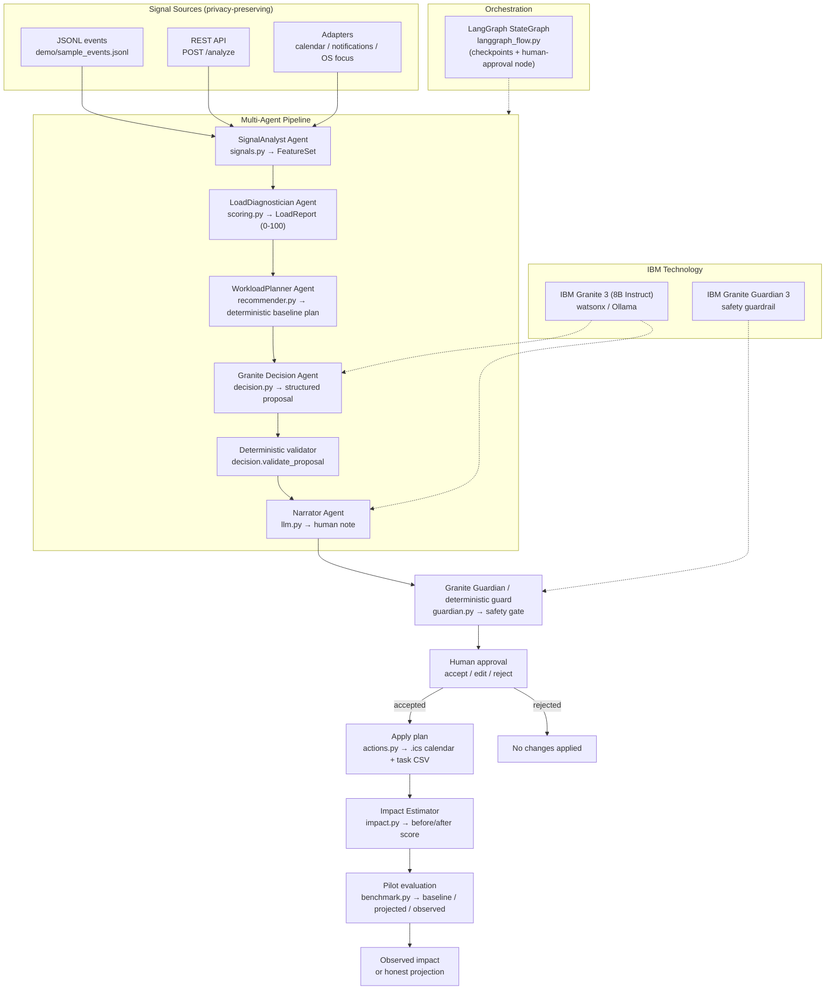

# 🧠 LoadGuard — Cognitive-Load-Aware AI Co-Worker

> **An AI co-worker whose job is to protect you from the other AI co-workers.**
>
> Built for the **IBM AI Builders Challenge 2026 — Wildcard: "Build Intelligent Systems for the Future of Work"**.

LoadGuard senses when a knowledge worker is heading toward **"AI brain fry"** — the cognitive
overload caused by too many AI-driven interruptions — and proactively **resequences the workday,
delegates low-priority tasks, and inserts recovery blocks** before the human crashes.

---

## 🎯 Selected Challenge Theme

**Wildcard Challenge — Build Intelligent Systems for the Future of Work.**

AI is evolving from a productivity tool into a collaborator. LoadGuard answers the inverse and
overlooked half of that promise: **if AI becomes a co-worker, it must also learn to protect the
human's attention budget** — not just consume it. It maps directly onto three example solution
areas from the brief: **AI co-workers**, **decision intelligence platforms**, and **operations &
productivity solutions**.

---

## ✅ Submission Requirements Checklist

| Official requirement | Where LoadGuard satisfies it |
| --- | --- |
| Working prototype using IBM Bob | `src/`, `demo/`, `app.py` — Bob-built (see `.bob/` + `bob_sessions/`) |
| Required IBM SkillsBuild learning activity | In progress on skillsbuild.org — completion certificate attached at submission time |
| Public GitHub repository | This repo (made public at submission time) |
| README: problem / solution / AI approach / theme / Bob usage |
| Project page + public demo video (≤3 min) | Submitted on the challenge platform |

## ❗ Problem Statement

The 2026 AI-first workplace has a paradox: more "productivity" AI produces *less* productive,
*more* exhausted humans.

- Research at UC Irvine (Gloria Mark et al., "The Cost of Interrupted Work") found it takes an
  average of **~23 minutes** to fully refocus after an interruption.
- The American Psychological Association estimates that **task switching can consume up to 40% of
  productive time**.
- Each new AI assistant adds notifications, context switches, and micro-decisions — multiplying
  these interruption costs at scale.
- Burnout is recognized by the WHO (ICD-11) as an occupational phenomenon driven by chronic
  workplace stress.

Existing tools optimize **output**. Almost none protect the human's **attention budget**. The
result is a measurable, real-world problem: reduced focus, higher error rates, and burnout.

**LoadGuard answers one question:** *when does the AI need to slow down, so the human can keep up?*

---

## 💡 Solution Description

LoadGuard is a cognitive-load-aware AI co-worker that closes the loop — **sense → diagnose →
Granite proposes → LoadGuard validates → human approves → LoadGuard acts → the result is
measured**:

1. **Sense** — ingests lightweight, privacy-preserving signals (context switches, meeting density,
   notification rate, focus blocks). Only counts and ratios are captured — never screen content,
   keystrokes, or message bodies.
2. **Diagnose** — computes an **explainable Cognitive Load Score (0–100)** from transparent,
   weighted behavioral proxies, with a low / moderate / high / overload level, plus a personal
   baseline, trend, and confidence.
3. **Granite proposes** — the Granite Decision Agent proposes which task to prioritize, which to
   delegate, and when to insert focus/recovery blocks. A **deterministic gate** rejects anything
   unsafe (invented data, delegating critical work, invalid actions).
4. **Validate** — **Granite Guardian** (with a deterministic fallback) checks the plan and
   narrative for respect, absence of medical diagnosis, sensitive data, and scope.
5. **Approve & act** — the human accepts, edits, or rejects the plan. On acceptance LoadGuard
   exports the protected blocks to a real **`.ics` calendar** and the resequenced task list.
6. **Measure** — projected before/after score, plus **observed** metrics when outcome signals are
   recorded.

LoadGuard is **AI as a partner, not a replacement**: the human always decides, every score is
traceable to a named signal, and the system never diagnoses stress, burnout, or any medical
condition.

---

## 🤖 AI Approach & Architecture

LoadGuard uses a **hybrid, multi-agent pipeline**: a deterministic, explainable scoring layer acts
as the *guardrail*, while the LLM contributes *planning and natural-language reasoning*. This keeps
recommendations grounded, reproducible, and safe even when the model is swapped out.

<!-- Architecture diagram is generated from docs/architecture.mmd — keep both in sync. -->


Each agent is a small, independently testable unit with a single responsibility:

| Agent | Responsibility | Deterministic / LLM |
| --- | --- | --- |
| **SignalAnalyst** | Aggregate raw events into normalized features | Deterministic |
| **LoadDiagnostician** | Weighted Cognitive Load Score + level + drivers | Deterministic |
| **WorkloadPlanner** | Deterministic safety-baseline plan | Deterministic |
| **Granite Decision** | Propose what to prioritize / delegate / block | LLM (Granite) + deterministic gate |
| **Narrator** | Plain-language explanation of the plan | LLM (Granite) |
| **Guardian** | Safety check of plan + narrative | Deterministic + Granite Guardian |
| **Impact Estimator** | Project the load score *after* following the plan | Deterministic |
| **Pilot Evaluation** | Baseline / projected / observed measurement | Deterministic |

The loop is wired as a real **LangGraph `StateGraph`** (`langgraph_flow.py`) with an explicit
human-approval checkpoint; the same node functions run sequentially when LangGraph is not
installed, preserving the zero-dependency guarantee.

Full details: [`docs/architecture.md`](docs/architecture.md) · [`docs/architecture.mmd`](docs/architecture.mmd)

---

## ☁️ IBM Technology Stack

| Technology | Role |
| --- | --- |
| **IBM Bob** | Primary development tool (planning, code, tests, debugging) — see below |
| **IBM Granite 3 (8B Instruct)** | Decision + narrator agents: proposes the structured plan and writes the explanation (`ibm/granite-3-8b-instruct` via watsonx) |
| **IBM Granite (local)** | Same roles, running locally via Ollama — no cloud keys (`granite3.1-dense:8b`) |
| **IBM Granite Guardian 3** | Implemented safety guardrail (`guardian.py`): validates respect, no medical diagnosis, no sensitive data, in-scope (`ibm/granite-guardian-3-8b`; deterministic fallback without a model) |
| **watsonx.ai** | Cloud model runtime (LangChain `ChatWatsonx`) |
| **LangChain / LangGraph** | Real orchestration via a `StateGraph` (`langgraph_flow.py`), with a sequential fallback when not installed |

---

## 🧑‍💻 How IBM Bob Was Used

IBM Bob acted as our primary AI pair-programming partner across the full SDLC:

- **Planning & design** — Bob helped draft the solution design, module boundaries, and the
  multi-agent pipeline (Specification-Driven Development).
- **Implementation** — Bob generated and iterated on `signals.py`, `scoring.py`, `recommender.py`,
  `agents.py`, and the FastAPI layer.
- **Testing** — Bob generated unit tests for the scoring engine and edge cases.
- **Debugging & review** — Bob was used to troubleshoot and review changes during development.

We also packaged the workflow as a **custom Bob mode** so the team could drive LoadGuard
development through consistent, repeatable prompts:

- [`.bob/custom_modes.yaml`](.bob/custom_modes.yaml) — the "Cognitive Load Engineer" mode.
- [`bob_sessions/`](bob_sessions/) — session exports documenting Bob's role in architecture and
  implementation.

---

## ✨ Core Features

- **Signal ingestion** — JSONL event stream plus adapter-ready interfaces for calendar and
  notification sources.
- **Real-signal capture** — `scripts/capture_signals.py` turns a real calendar (ICS) + notification
  log into events, so the project runs on real data, not just the synthetic sample.
- **Explainable Cognitive Load Score** — 0–100 with per-factor contributions, so users can see
  *why* a recommendation was made.
- **Granite Decision Agent** — Granite proposes the plan structure; a deterministic gate rejects
  unsafe proposals (invented data, critical-task delegation).
- **Granite Guardian safety gate** — validates respect, no medical diagnosis, no sensitive data,
  in-scope; deterministic fallback always on.
- **Human approval & action** — accept / edit / reject, then export protected blocks to **`.ics`**
  and the resequenced tasks to **CSV**.
- **Personalized baseline & trend** — score vs. your own history, with trend direction and
  confidence.
- **Measurable impact, honestly labelled** — *projected* before/after score, plus *observed*
  metrics when outcome signals are supplied (`demo/benchmark.py --pilot`).
- **Real LangGraph orchestration** — `StateGraph` with a human-approval checkpoint.
- **IBM Bob MCP server** — `mcp_server/` exposes the pipeline (propose, approve, export, evaluate)
  as MCP tools so IBM Bob can drive it.
- **Local-first & privacy-preserving** — signals are processed on-device; only derived aggregates
  and task titles reach the LLM (never screen content, keystrokes, or message bodies). Consent,
  retention, and delete-your-history controls are surfaced in the dashboard.
- **Deterministic fallback** — the full pipeline runs with zero API keys, so judges can reproduce
  it instantly.
- **Self-contained HTML dashboard** — `demo/demo.py --html report.html` renders a shareable report.
- **Docker + CI** — single-command deployment and GitHub Actions (pytest + ruff).

---

## 🚀 Getting Started

### 1. Quick demo (no dependencies, no API keys)

```bash
python demo/demo.py                 # print the load report + plan (pending approval)
python demo/demo.py --accept        # approve the plan and export the .ics + task CSV
python demo/demo.py --history history.jsonl   # compare vs your personal baseline
python demo/demo.py --html report.html   # generate a self-contained HTML dashboard
```

### 2. Run the tests

```bash
python -m unittest discover -s tests
```

### 2.1 Benchmark (objective metrics)

```bash
python demo/benchmark.py [path/to/events.jsonl]

# Three-phase pilot evaluation (baseline / projected / observed).
# Observed metrics are only reported when outcome signals are supplied.
python demo/benchmark.py --pilot events.jsonl --outcome outcome.jsonl
```

### 2.2 Capture real signals (calendar + notifications)

```bash
python scripts/capture_signals.py \
    --calendar calendar.ics \
    --notifications notifications.log \
    --out signals.jsonl
python demo/benchmark.py signals.jsonl
```

### 2.3 IBM Bob MCP server

```bash
pip install mcp
python mcp_server/server.py --self-test
```

### 3. Run the REST API + dashboard (optional)

```bash
pip install -r requirements.txt
python app.py
# GET  /                          -> interactive dashboard (accept/edit/reject + timeline + privacy)
# POST /analyze                   -> {"events": [...], "tasks": [...]} + proposal + guardian + trend
# POST /approve | /feedback       -> record the human decision
# GET  /plan/{id}/export.ics      -> protected-blocks calendar
# GET  /plan/{id}/export.csv      -> resequenced task list
# GET|POST|DELETE /history        -> personal baseline (deletable)
# GET  /privacy                   -> exactly what is / isn't captured
# GET  /health
```

### 4. Docker

```bash
docker build -t loadguard .
docker run -p 8000:8000 loadguard
```

### 5. Enable the IBM Granite runtime (optional)

The decision agent, narrator, and guardian can run two ways (the deterministic engine is the
always-available fallback):

**Local (no cloud keys)** — IBM Granite via Ollama:

```bash
ollama pull granite3.1-dense:8b
cp .env.example .env   # set LLM_PROVIDER=ollama
```

**Cloud** — IBM Granite via watsonx:

```bash
cp .env.example .env   # set LLM_PROVIDER=watsonx + WATSONX_API_KEY / WATSONX_PROJECT_ID
```

Without either, the pipeline uses the deterministic engine (still fully functional).

---

## 📊 Evaluation

The demo computes a **before/after Cognitive Load Score** and clearly distinguishes the two kinds
of impact:

- **Projected impact** (`Impact Estimator`) — what the plan is *expected* to achieve, under
  documented assumptions (see [`docs/architecture.md`](docs/architecture.md#impact-estimator)).
- **Observed impact** (`demo/benchmark.py --pilot`) — *measured* reductions (interruptions during
  focus blocks, context switches, focus minutes gained, load delta) once outcome signals are
  recorded after applying the plan.

> The bundled `demo/sample_events.jsonl` is a **synthetic, reproducible** dataset used for a
> deterministic demo. Real signals can be captured with `scripts/capture_signals.py` from a
> calendar + notification log; without observed outcome signals the pilot is honestly labelled as
> a projection, never as real-world evidence.

---

## 🏗️ Project Structure

```
cognitive-load-ai-coworker/
├── app.py                     # FastAPI entrypoint (serves dashboard + /analyze)
├── src/loadguard/
│   ├── models.py              # dataclasses: Event, Task, LoadReport, Plan
│   ├── signals.py             # ingest events, compute features
│   ├── scoring.py             # weighted Cognitive Load Score (0–100)
│   ├── recommender.py         # deterministic planner
│   ├── decision.py            # Granite Decision Agent + deterministic gate
│   ├── guardian.py            # Granite Guardian + deterministic safety guard
│   ├── baseline.py            # personal baseline, trend, confidence
│   ├── actions.py             # human approval, .ics/CSV export, audit trail
│   ├── agents.py              # SignalAnalyst / Diagnostician / Planner / Narrator
│   ├── workflow.py            # end-to-end multi-agent orchestration
│   ├── langgraph_flow.py      # LangGraph StateGraph (+ sequential fallback)
│   ├── impact.py              # before/after impact estimator
│   ├── benchmark.py           # objective metrics + pilot evaluation
│   ├── llm.py                 # ChatModel: heuristic / watsonx / ollama (Granite)
│   └── api.py                 # FastAPI routes
├── demo/
│   ├── sample_events.jsonl    # realistic overload-morning signal stream
│   ├── demo.py                # zero-dependency CLI + HTML report generator
│   └── benchmark.py           # benchmark CLI
├── scripts/
│   ├── capture_signals.py     # real-signal capture (ICS calendar + notifications)
│   └── sample_calendar.ics    # sample ICS for the capture demo
├── mcp_server/
│   └── server.py              # MCP tools so IBM Bob drives the pipeline
├── .bob/
│   ├── custom_modes.yaml      # IBM Bob "Cognitive Load Engineer" mode
│   └── mcp.json               # register the LoadGuard MCP server
├── bob_sessions/              # IBM Bob session exports
├── tests/                     # unit tests (scoring, workflow, benchmark, capture)
└── docs/
    ├── architecture.md        # detailed architecture + scoring rationale
    ├── architecture.mmd       # Mermaid architecture diagram
    └── references.md          # research citations
```

## 👥 Team

- *(add team member names, universities, and roles here)*

## 📄 License

MIT — see [LICENSE](LICENSE).
