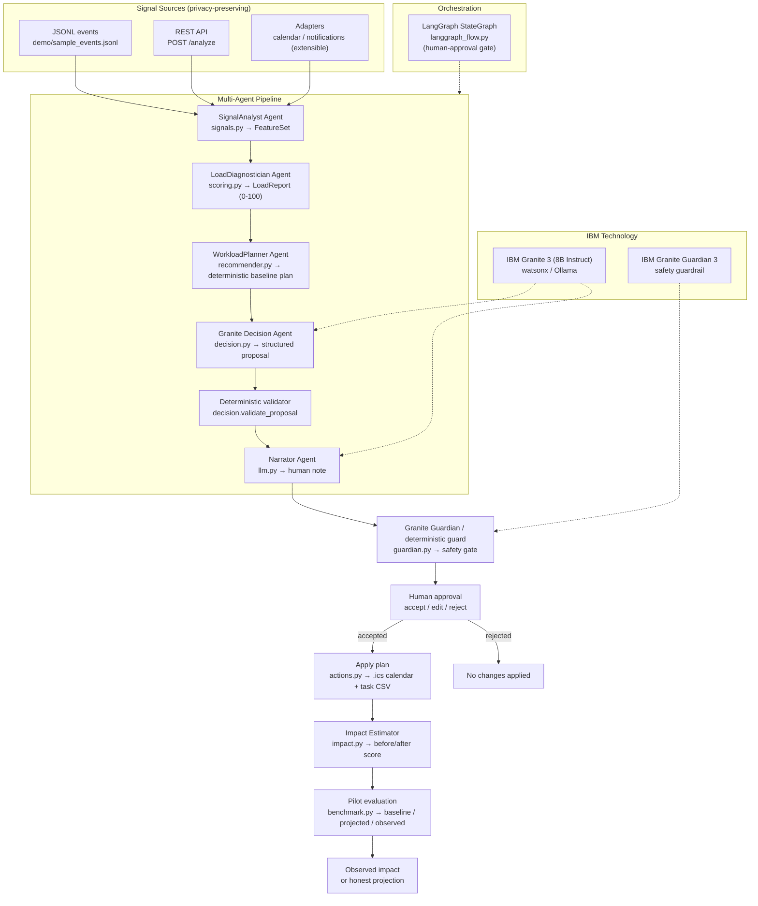

# 🧠 LoadGuard — Cognitive-Load-Aware AI Co-Worker

[](https://github.com/Aitor42/cognitive-load-ai-coworker/actions/workflows/ci.yml)
[](https://github.com/Aitor42/cognitive-load-ai-coworker)

> **An AI co-worker whose job is to protect you from the other AI co-workers.**
>
> Built for the **IBM AI Builders Challenge 2026 — Wildcard: “Build Intelligent Systems for the Future of Work”**.

LoadGuard detects behavioral signals associated with excessive interruptions and helps reshape the workday: it proposes focus and recovery blocks, delegates eligible low-priority work, and makes the expected impact explicit. The user always reviews and approves changes before anything is applied.

> **Prototype notice:** the Cognitive Load Score is an explainable behavioral proxy, not a medical or physiological measurement. LoadGuard does not diagnose stress, burnout, or any health condition.

---

## Contents

- [Why LoadGuard](#-why-loadguard)
- [What it does](#-what-it-does)
- [AI approach and architecture](#-ai-approach-and-architecture)
- [IBM technology](#️-ibm-technology)
- [Quick start](#-quick-start)
- [Optional API and dashboard](#-optional-api-and-dashboard)
- [Optional Granite models](#-optional-granite-models)
- [Real signals and daily scheduling](#-real-signals-and-daily-scheduling)
- [MCP server for IBM Bob](#-mcp-server-for-ibm-bob)
- [Data, privacy, and limitations](#-data-privacy-and-limitations)
- [Evaluation](#-evaluation)
- [Project structure](#️-project-structure)
- [Development](#-development)
- [IBM Bob usage](#-ibm-bob-usage)
- [Team and license](#-team-and-license)

## 🎯 Why LoadGuard

AI assistants can increase output while also increasing notifications, context switches, and micro-decisions. Existing productivity tools generally optimize throughput; LoadGuard treats human attention as a finite resource.

The system answers: **when should AI slow down so the human can keep up?**

The challenge alignment is the **Wildcard — Future of Work**, particularly its AI co-worker, decision intelligence, and operations/productivity themes. Background sources and citations are available in [`docs/references.md`](docs/references.md).

## 💡 What it does

LoadGuard follows this reviewable loop:

1. **Sense** — reads privacy-preserving events such as meetings, notifications, context switches, and focus blocks.
2. **Diagnose** — calculates an explainable score from 0 to 100, including level, drivers, trend, baseline, and confidence.
3. **Propose** — the deterministic planner and optional Granite Decision Agent suggest task ordering, eligible delegation, and focus/recovery blocks.
4. **Validate** — a deterministic gate and optional Granite Guardian reject unsafe, invented, critical, or out-of-scope changes.
5. **Approve** — the human accepts, edits, or rejects the plan.
6. **Act and measure** — accepted plans can export an `.ics` calendar and task CSV; impact is labelled projected unless real outcome signals are supplied.

The default mode is local and deterministic. No API key is required for the CLI demo or core library.

---

## 🤖 AI approach and architecture

LoadGuard uses a hybrid multi-agent pipeline: deterministic code provides explainable scoring and safety boundaries, while Granite contributes structured planning and natural-language explanation when configured.

<!-- Architecture diagram is generated from docs/architecture.mmd — keep both in sync. -->


| Component | Responsibility | Default implementation |
| --- | --- | --- |
| Signal Analyst | Aggregate raw events into normalized features | Deterministic |
| Load Diagnostician | Weighted score, level, factors, and explanation | Deterministic |
| Workload Planner | Safe baseline plan | Deterministic |
| Granite Decision Agent | Structured proposal for prioritization and scheduling | Optional Granite + deterministic gate |
| Narrator | Plain-language explanation | Optional Granite / heuristic fallback |
| Guardian | Safety and scope checks | Deterministic + optional Granite Guardian |
| Impact Estimator | Projected before/after score | Deterministic |
| Pilot Evaluation | Baseline, projected, and observed metrics | Deterministic |

Detailed design and scoring rationale: [`docs/architecture.md`](docs/architecture.md) · [`docs/architecture.mmd`](docs/architecture.mmd).

## ☁️ IBM technology

| Technology | Role |
| --- | --- |
| **IBM Bob** | Planning, implementation, testing, debugging, and review |
| **IBM Granite 3** | Optional decision and narrator model via watsonx or Ollama |
| **IBM Granite Guardian 3** | Optional model-based safety check; deterministic guard remains enabled |
| **watsonx.ai** | Cloud runtime through `langchain-ibm` |
| **LangChain / LangGraph** | Optional model integration and `StateGraph` orchestration |

## ✨ Main capabilities

- Explainable Cognitive Load Score from 0–100 with named factors and interaction terms.
- **Role profile sensitivity tuning** (developer, manager, researcher, support) for personalized scoring.
- **Timezone-aware planning** with dynamic late-day fatigue protection (post-16:00 workload adaptation).
- **Collision-free `.ics` export** with multi-calendar interval merging and configurable `VALARM` notifications.
- Synthetic JSONL demo and adapters for calendar/notification signals.
- Human approval flow: accept, edit, or reject plans interactively.
- Personal baseline, trend, confidence, local history, and audit trail.
- Team absences and deadline-aware reassignment alerts.
- Midday end-of-day projection and afternoon re-organization.
- Self-contained HTML report, interactive web dashboard, LangGraph orchestration, and IBM Bob MCP tools.
- Deterministic fallback with zero API keys required.

---

## 🚀 Quick start

### Requirements

- Python **3.11 or newer**.
- `pip`.
- Optional: Docker, Ollama, or IBM watsonx credentials depending on the integration you want.

### Run the zero-dependency demo

From the repository root:

```bash
python demo/demo.py
```

The command reads `demo/sample_events.jsonl`, prints the score and a pending plan, and does not need third-party packages or API keys. To approve and export the plan:

```bash
python demo/demo.py --accept --out outputs
# outputs/loadguard-<plan-id>.ics
# outputs/loadguard-<plan-id>.csv
```

Other useful modes:

```bash
python demo/demo.py --role developer          # role-specific sensitivity (developer / manager / researcher / support)
python demo/demo.py --history history.jsonl   # compare vs personal baseline
python demo/demo.py --html report.html        # generate self-contained HTML report
python demo/benchmark.py --pilot demo/sample_events.jsonl  # 3-phase pilot evaluation
```

Or using the `Makefile` shortcuts:

```bash
make demo        # Run CLI demo
make pilot       # Run 3-phase pilot evaluation
make serve       # Launch live web dashboard at http://127.0.0.1:8000
```

### Install development dependencies

The project uses `pyproject.toml` as the dependency source of truth. Install the complete local development setup with:

```bash
pip install ".[api,llm,bob,dev]"
```

The optional groups are:

- `api`: FastAPI, Uvicorn, Pydantic, and HTTPX.
- `llm`: LangChain, `langchain-ibm`, and LangGraph.
- `bob`: MCP support for IBM Bob.
- `dev`: coverage, Ruff, and mypy.

---

## 🌐 Optional API and dashboard

Install the API layer and start the local server:

```bash
pip install ".[api]"
HOST=127.0.0.1 python app.py
```

Open <http://127.0.0.1:8000/> for the dashboard. The API has no authentication and includes delete endpoints, so keep it on loopback unless you explicitly secure it. Docker uses `0.0.0.0` inside the container.

Useful endpoints:

| Method | Endpoint | Purpose |
| --- | --- | --- |
| `GET` | `/` | Interactive dashboard |
| `GET` | `/health` | Health check |
| `GET` | `/sample` | Sample events, tasks, and workers |
| `POST` | `/analyze` | Analyze events and create a pending plan |
| `POST` | `/ingest` | Parse uploaded ICS or JSONL text |
| `POST` | `/midday` | Project the end of day and optionally re-plan |
| `POST` | `/approve` | Accept, edit, or reject a plan |
| `POST` | `/feedback` | Record feedback about a plan |
| `GET` | `/plan/{id}/export.ics` | Download calendar export |
| `GET` | `/plan/{id}/export.csv` | Download task export |
| `GET/POST/DELETE` | `/history` | Manage personal score history |
| `GET/DELETE` | `/audit` | Read or delete local decision audit records |
| `GET/POST` | `/pilot` | Run pilot evaluation |
| `GET` | `/privacy` | Show captured and never-captured data |

Interactive API documentation is available at <http://127.0.0.1:8000/docs>.

### Docker

```bash
docker build -t loadguard .
docker run --rm -p 8000:8000 loadguard
```

Then visit <http://127.0.0.1:8000/>. The container includes the API, LLM, and MCP optional dependencies.

---

## 🧠 Optional Granite models

By default `LLM_PROVIDER=heuristic`; the deterministic engine is always available. To configure a provider:

```bash
cp .env.example .env
```

The application reads configuration from process environment variables. Copy `.env.example` as a reference, then export the variables in your shell or load them with your preferred dotenv process.

### Local Granite with Ollama

Start Ollama, install the model, and select the provider:

```bash
ollama serve
ollama pull granite3.1-dense:8b
export LLM_PROVIDER=ollama
export OLLAMA_URL=http://localhost:11434
export OLLAMA_MODEL=granite3.1-dense:8b
```

### Granite through watsonx

Set the provider and required credentials:

```bash
export LLM_PROVIDER=watsonx
export WATSONX_API_KEY=your-api-key
export WATSONX_PROJECT_ID=your-project-id
export WATSONX_URL=https://us-south.ml.cloud.ibm.com
export WATSONX_MODEL_ID=ibm/granite-3-8b-instruct
```

`WATSONX_GUARDIAN_MODEL_ID` and `OLLAMA_GUARDIAN_MODEL` can select separate Guardian models. Never commit `.env` or API keys.

---

## 📅 Real signals and daily scheduling

Capture events from an ICS calendar and a notification log:

```bash
python scripts/capture_signals.py \
  --calendar calendar.ics \
  --notifications notifications.log \
  --out signals.jsonl
python demo/benchmark.py signals.jsonl
```

Absence records can be exported without retaining event summaries or personal reasons:

```bash
python scripts/capture_signals.py \
  --calendar calendar.ics \
  --absences-out absences.jsonl \
  --workers-out workers.jsonl \
  --worker-id me --worker-name Ada
```

Run the morning + midday cycle:

```bash
python scripts/schedule.py
python scripts/schedule.py --events signals.jsonl --elapsed-minutes 240 --total-minutes 480
```

The scheduler is cron-friendly, but the underlying functions are pure and can also be called from another scheduler.

---

## 🔌 MCP server for IBM Bob

The MCP server exposes analysis, proposal, approval, export, and evaluation tools.

```bash
pip install ".[bob]"
python mcp_server/server.py --self-test
```

To register it with IBM Bob, see [`mcp_server/README.md`](mcp_server/README.md) and [`.bob/mcp.json`](.bob/mcp.json). The server uses local data and should only be exposed to trusted clients.

---

## 📊 Evaluation

LoadGuard distinguishes two kinds of impact:

- **Projected:** calculated by `src/loadguard/impact.py` from documented assumptions about batching, focus blocks, breaks, and delegation.
- **Observed:** calculated by `demo/benchmark.py --pilot ... --outcome ...` or `POST /pilot` only when post-plan outcome events are provided.

Run the benchmark:

```bash
python demo/benchmark.py
python demo/benchmark.py path/to/events.jsonl
python demo/benchmark.py --pilot events.jsonl --outcome outcome.jsonl
```

The bundled sample data is synthetic and reproducible. It demonstrates the pipeline; it is not evidence of real-world effectiveness.

## 🔒 Data, privacy, and limitations

LoadGuard is local-first. It is designed to capture counts, durations, timestamps, and opaque/source labels—not screen content, keystrokes, message bodies, audio/video, physiological data, or health data. Absence reasons are not retained.

When a Granite provider is enabled, only the derived aggregates and the minimum task information required for planning are sent to that model runtime. Review your provider’s data-handling terms before using real workplace data.

The score has important limits:

- It is a transparent behavioral proxy, not a diagnosis or clinical measurement.
- Thresholds and weights are prototype assumptions and may not generalize across people or teams.
- A projected reduction is not an observed result.
- The API has no authentication and persists local history, plans, and audit data under `.loadguard/`; protect or delete that directory as appropriate.

The dashboard’s `/privacy` endpoint documents the current capture contract.

---

## 🏗️ Project structure

```text
cognitive-load-ai-coworker/
├── app.py                     # FastAPI entrypoint
├── pyproject.toml             # package metadata and optional dependency groups
├── requirements.txt           # installs the API + LLM + MCP groups
├── src/loadguard/
│   ├── models.py              # domain dataclasses
│   ├── signals.py             # event ingestion and feature aggregation
│   ├── scoring.py             # weighted score (0–100)
│   ├── recommender.py         # deterministic planner
│   ├── decision.py             # Granite proposal + deterministic gate
│   ├── guardian.py             # safety validation
│   ├── baseline.py             # personal history, trend, confidence
│   ├── actions.py              # approval, ICS/CSV export, audit
│   ├── agents.py               # thin agent wrappers
│   ├── workflow.py              # end-to-end orchestration
│   ├── langgraph_flow.py        # LangGraph StateGraph + fallback
│   ├── impact.py                # projected impact
│   ├── availability.py          # absences and reassignment alerts
│   ├── projection.py            # midday projection
│   ├── scheduler.py             # daily-cycle orchestration
│   ├── benchmark.py             # objective and pilot metrics
│   ├── llm.py                   # heuristic, watsonx, and Ollama models
│   └── api.py                   # FastAPI routes
├── demo/
│   ├── sample_events.jsonl      # reproducible sample input
│   ├── demo.py                  # CLI and HTML report
│   └── benchmark.py             # benchmark CLI
├── scripts/
│   ├── capture_signals.py       # ICS + notification capture
│   └── schedule.py              # morning + midday CLI
├── mcp_server/                  # MCP tools for IBM Bob
├── .bob/                        # Bob mode and MCP configuration
├── tests/                       # unit and documentation-sync tests
└── docs/                        # architecture and references
```

## 🧪 Development

The Makefile mirrors the CI checks:

```bash
make test       # unit tests
make coverage   # branch coverage; requires 100%
make mypy       # type checking
make lint       # Ruff lint + formatting check
make check      # complete gate
```

Equivalent commands are documented in `Makefile` and run by GitHub Actions on Python 3.11 and 3.12. Before opening a pull request, run `make check`.

## 🧑‍💻 IBM Bob usage

IBM Bob was used for planning, architecture, implementation, tests, debugging, and review. The repeatable project mode is [`.bob/custom_modes.yaml`](.bob/custom_modes.yaml) and session exports are in [`bob_sessions/`](bob_sessions/).

The MCP integration lets Bob invoke the LoadGuard pipeline during development; it is documented separately in [`mcp_server/README.md`](mcp_server/README.md).

## 👥 Team and license

- *(add team member names, universities, and roles here)*

MIT — see [`LICENSE`](LICENSE).
